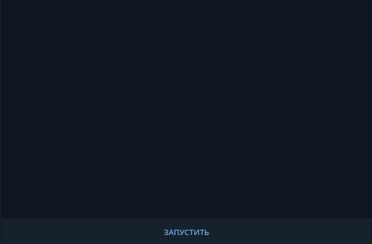

# Check My Biopassport (KG) 🇰🇬

A [Telegram bot](https://t.me/check_biopassport_KG_bot) for checking the status of Russian biometric passport readiness when submitting documents in Kyrgyzstan.

## How it works

Enter a short application number, no more than 8 digits, or a full identification number - 25 digits.  
If the application number exists, you will receive information about the current status of the passport, otherwise "Number not found."  
There is a functionality for selecting the city of application submission, Bishkek and Osh. 

The response includes the following information:

- Request date
- Application UID
- Date of application submission
- Main status
- Internal status
- Readiness

## Demo



Direct link to the bot: [https://t.me/check_biopassport_KG_bot](https://t.me/check_biopassport_KG_bot)

## Deployment

Deployment process as easy as possible:
Required software:
- terminal for running bash scripts
- docker
- docker-compose

to deploy application, switch to needed branch and run bash script:

```
bash start.sh bot_username bot_token db_user db_password
```

Another option is to create a separate `docker-compose.yaml` file and directly specify all the logins and passwords in it, as well as specify which images to run.  
Then run command:
```
docker-compose up -d
```

That's all.

## Local development

There are several options for local deployment and testing:

### Variant 1

Run command:
```
bash start.sh bot_username bot_token db_user db_password
```

### Variant 2

Use `docker-compose-dev.yml`.
Run command:
```
docker-compose -f docker-compose-dev.yml up
```
Next step, is to run Spring Boot app with configured **Edit Configuration** in which four env vars are provided:

`bot.token=bot_token;bot.username=bot_username;spring.datasource.username=db_username;spring.datasource.password=db_password`

And add VM Options:

`-Dspring.profiles.active=dev `

With these configurations - run Spring Boot main method.

## Technological stack

- Spring Boot as a skeleton framework
- Postgresql database as a database for saving user info
- Flyway database migration tool
- Telegram-bot SpringBoot starter
- Spring Data starter
- Unirest - lib for working with REST calls

## License

This project is Apache License 2.0 - see the [LICENSE](LICENSE) file for details
